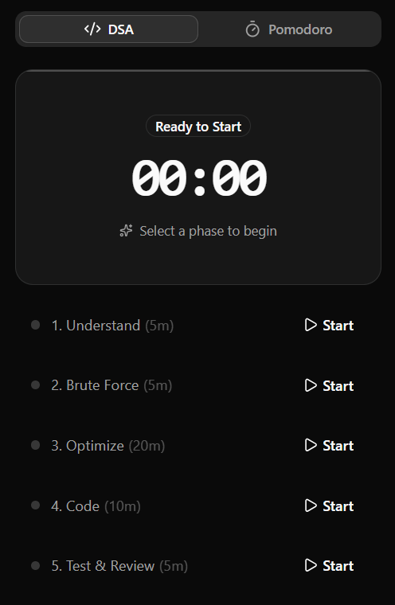
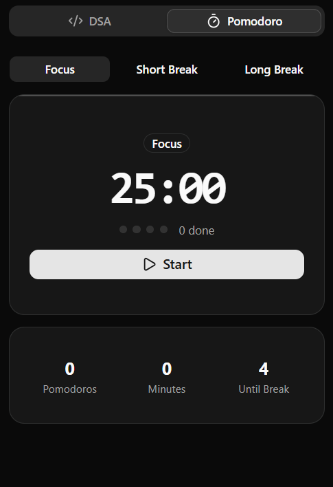

# ⏳ DSA Timer

A strict, phase-based Chrome Extension designed to help developers master Data Structures and Algorithms (DSA) by enforcing structured timeboxing.



## 🎯 The Problem
When practicing DSA on platforms like LeetCode, it is incredibly easy to fall into "analysis paralysis" or spend 45 minutes coding a flawed brute-force approach. To succeed in technical interviews, you need to build mental muscle memory around a structured problem-solving framework.

## 🚀 The Solution
This extension enforces a battle-tested 45-minute interview framework by breaking your session down into strict, isolated timeboxes. It runs reliably in the background using Chrome's Alarms API, ensuring your timer never resets when you click away to write code.

### ⏱️ The 45-Minute Blueprint
1. **Understand (5 min):** Clarify the prompt, identify inputs/outputs, and note constraints.
2. **Brute Force (5 min):** State the naive approach and its complexities. Don't code yet.
3. **Optimize (20 min):** Find bottlenecks and apply patterns (Sliding Window, Two Pointers, etc.). *Includes a built-in alert to stop and check the solution if you are completely stuck.*
4. **Code (10 min):** Write clean, modular code based on your optimal approach.
5. **Test & Review (5 min):** Trace through the code with small test cases.

## ✨ Features
* **Multi-Phase Timeboxing:** Jump between distinct problem-solving phases manually or let the timer guide you.
* **Pomodoro Integration:** Includes a secondary tab for standard Pomodoro focus sessions.
* **Persistent Background Processing:** Built with Chrome Service Workers so the timer continues running even when the popup is closed.
* **System Notifications:** Pushes native OS alerts when a phase is complete.
* **Premium UI:** Designed using Radix primitives, `shadcn/ui`, and Tailwind CSS for a sleek, accessible, and responsive interface.

## Additional Study Feature



## 🛠️ Tech Stack
* **Framework:** React + Vite
* **Styling:** Tailwind CSS + shadcn/ui
* **Icons:** Lucide React
* **Platform:** Chrome Extensions API (Manifest V3)

## 📦 Installation & Setup

Since this extension requires a build step, follow these instructions to load it into your browser:

1. **Clone the repository**
   ```bash
   git clone [https://github.com/prrrrnav/DSA-Timer.git](https://github.com/prrrrnav/DSA-Timer.git)
   cd DSA-Timer


2.Install dependencies

    npm install


3.Build the extension

    npm run build

    This will generate a dist folder containing the compiled extension files.


4.Load into Chrome

    Open Google Chrome and navigate to chrome://extensions/.

    Enable Developer mode using the toggle switch in the top right corner.

    Click the Load unpacked button in the top left.

    Select the generated dist folder inside your project directory.

    Pin the extension to your toolbar for quick access!

🤝 Contributing
Contributions, issues, and feature requests are welcome! Feel free to check the issues page.

📝 License
This project is open-source and available under the MIT License.